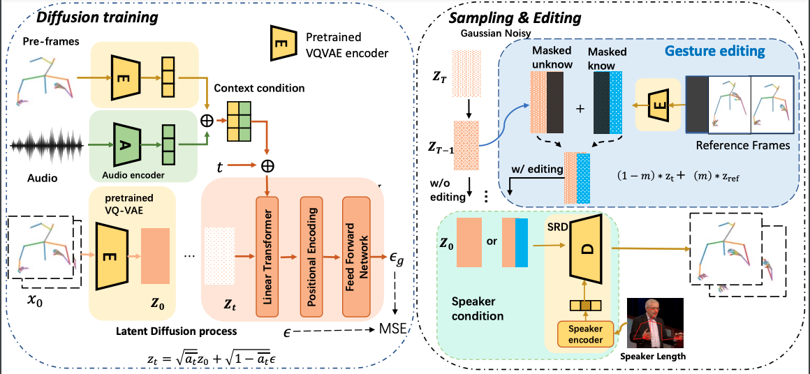

# C2G2: Controllable Co-speech Gesture Generation

This is the official code for [**C2G2: Controllable Co-speech Gesture Generation**](https://arxiv.org/abs/2308.15016).

[](https://arxiv.org/abs/2308.15016)  [](https://c2g2-gesture.github.io/c2_gesture/)

## Abstract
Co-speech gesture generation is crucial for automatic digital avatar animation. However, existing methods suffer from issues such as unstable training and temporal inconsistency, particularly in generating high-fidelity and comprehensive gestures. Additionally, these methods lack effective control over speaker identity and temporal editing of the generated gestures. Focusing on capturing temporal latent information and applying practical controlling, we propose a Controllable Co-speech Gesture Generation framework, named C2G2. Specifically, we propose a two-stage temporal dependency enhancement strategy motivated by latent diffusion models. We further introduce two key features to C2G2, namely a speaker-specific decoder to generate speaker-related real-length skeletons and a repainting strategy for flexible gesture generation/editing. Extensive experiments on benchmark gesture datasets verify the effectiveness of our proposed C2G2 compared with several state-of-the-art baselines.




## Installation & Preparation (If you only want to train or inference without visualization)

1. Clone this repository and install packages:
    ```
    https://github.com/C2G2-Gesture/C2G2.git
    pip install -r requirements.txt
    ```

2. Download pretrained vqvae, latent_diffusion and SRD from [here](https://drive.google.com/file/d/1Ll1x9e27cSIbUk1jkXUgVfzVE_miNv9j/view?usp=drive_link) and put into your selected path.

3. Download pretrained fasttext model from [here](https://dl.fbaipublicfiles.com/fasttext/vectors-english/crawl-300d-2M-subword.zip) and put `crawl-300d-2M-subword.bin` and `crawl-300d-2M-subword.vec` at `data/fasttext/`.

4. Download the autoencoder used for FGD. which include the following:

    For the TED Gesture Dataset, we use the pretrained Auto-Encoder model provided by Yoon et al. for better reproducibility [the ckpt in the train_h36m_gesture_autoencoder folder](https://kaistackr-my.sharepoint.com/:u:/g/personal/zeroyy_kaist_ac_kr/Ec1UIsDDLHtKia04_TTRbygBepXORv__kkq-C9IqZs32aA?e=bJGXQr).

    For the TED Expressive Dataset, the pretrained Auto-Encoder model is provided [here](https://mycuhk-my.sharepoint.com/:u:/g/personal/1155165198_link_cuhk_edu_hk/EWbBxUeuIHFDnBUgZFMCq1oBdiZSw6pOlmVxC8d9xS3HOg?e=IT1AoC).

    Save the models in `output/train_h36m_gesture_autoencoder/gesture_autoencoder_checkpoint_best.bin` for TED Gesture, and `output/TED_Expressive_output/AE-cos1e-3/checkpoint_best.bin` for TED Expressive.

5. Download two datasets (original dataset based on pyarrow no longer supported well) from [ted_expressive](https://drive.google.com/file/d/1acHid18ebrAwPTkYHaPVw8PeH4jPYGbx/view?usp=drive_link) and [ted_gesture](https://drive.google.com/file/d/1CsiAnGCbkjjyGM-85pArWMuircMEYba4/view?usp=drive_link), then put in `data/ted_expressive_pickle` and `data/ted_pickle` respectively.


## Training (e.g for expressive)

```
# Train vqvae
python scripts/train_vqvae_expressive.py --config=config/pose_diffusion_expressive.yml

# Train latent_diffusion
python scripts/train_expressive_latent.py --config=config/pose_diffusion_expressive.yml

# Finetune SRD to generate real-length speaker identity
python scripts/train_vqvae_expressive_cond.py --config=config/pose_diffusion_expressive.yml
```
#### Remember to change the vqvae_weight path in config file

## Inference(Normalized/real-identity)
#### The third and fourth term controls whether to use real identity and whether use re-painting, make sure a SRD weight is loaded with correct path.
```
# metrics evaluation (Normalized/real-length)
python scripts/test_expressive.py eval latent_diffusion False(/True) False

# metrics evaluation vqvae
python scripts/test_expressive.py eval vqvae False False

# synthesize normalized short videos
python scripts/test_expressive.py short latent_diffusion False False

# synthesize real-length short videos
python scripts/test_expressive.py short latent_diffusion True False

# synthesize normalized long videos
python scripts/test_expressive.py long latent_diffusion False False

# synthesize real-length long videos
python scripts/test_expressive.py long latent_diffusion True False
```
## Repainting Inference (Normalized/real-identity) (Not debugged)
Repainting applied for last 6 frames in short sequence and applied for last 6 frames of the last full step of generation. 
### The current code only support repaint for target sequence in dataset, you can modify the code to add in other poses and repaint for any part you want.
```
# synthesize short videos
python scripts/test_expressive.py short False(/True) True

# synthesize long videos
python scripts/test_expressive.py long False(/True) True
```

## Generate co-speech keypoints on local images given 4 frames of seed gesture and 1 frame identity reference. 
Required folder structure is shown in demos/clip1.
Current implementation requires 4 frames for both seed gesture and speaker identity, will be fixed later.
```
python scripts/generate_visual.py # seed_folder # identity folder

#for example
python scripts/generate_visual.py demos/data/clip1 demos/data/clip1
```


## Citation

If you find our work useful, please kindly cite as:
```
@article{ji2023c2g2,
  title={C2G2: Controllable Co-speech Gesture Generation with Latent Diffusion Model},
  author={Ji, Longbin and Wei, Pengfei and Ren, Yi and Liu, Jinglin and Zhang, Chen and Yin, Xiang},
  journal={arXiv preprint arXiv:2308.15016},
  year={2023}
}
```

## Acknowledgement
* The codebase is developed based on [Gesture Generation from Trimodal Context](https://github.com/ai4r/Gesture-Generation-from-Trimodal-Context) of Yoon et al, [HA2G](https://github.com/alvinliu0/HA2G) of Liu et al, and [Diffgesture](https://github.com/Advocate99/DiffGesture) of Zhu et at.
